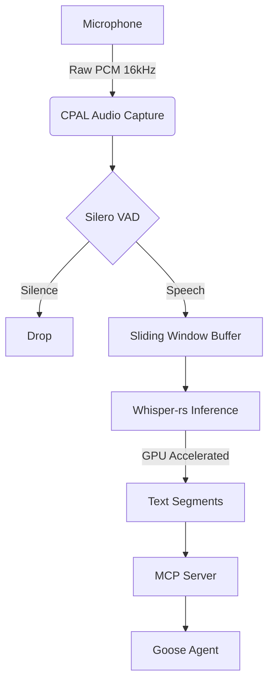

# STT Architecture for Goose

```mermaid
graph TD
    A[Microphone] -->|Raw PCM 16kHz| B(CPAL Audio Capture)
    B --> C{Silero VAD}
    C -->|Silence| D[Drop]
    C -->|Speech| E[Sliding Window Buffer]
    E --> F[Whisper-rs Inference]
    F -->|GPU Accelerated| G[Text Segments]
    G --> H[MCP Server]
    H --> I[Goose Agent]
```
